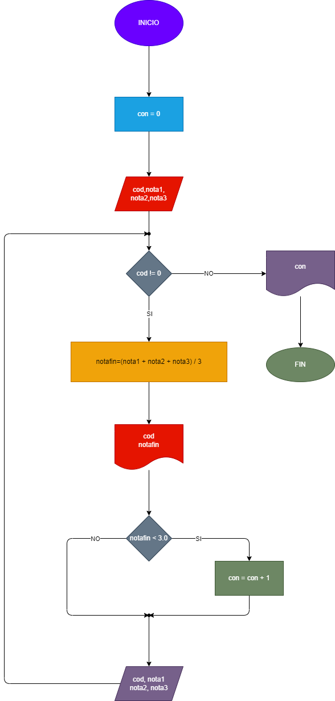

# Ejercicio 1

Hacer el diagrama de flujo y el programa en python que por cada estudiante lea el codigo y el nombre, y las notas de los tres parciales de una materia, y que calcule e imprima la nota de final de cada estudiante. No sabemos cuantos estudiantes son, pero despues de la informacion del ultimo, se introduce cero en el campo correspondiente al codigo, de modo tal que sirva como **centinela**, para indicar cuando terminan los datos e entrada. Tambien se debe informar al final cuantos estudiantes perdieron la materia. 

